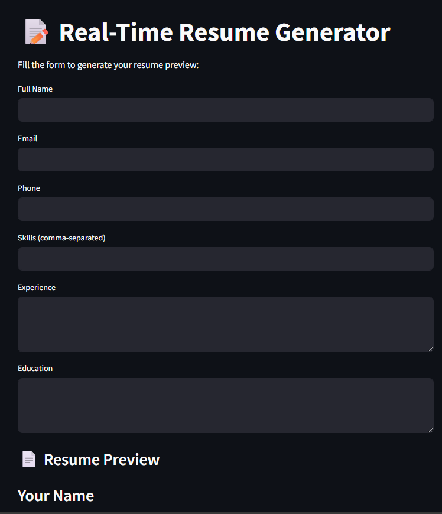

# 🧾 Real-Time Resume Generator




---

## 🚀 Overview

The **Real-Time Resume Generator** is a dynamic web application that allows users to generate modern, professional resumes based on live inputs. The app provides real-time preview and offers a downloadable PDF feature — all through a clean, user-friendly interface.

---

## 🔧 Features

- 📄 Live resume preview as you type  
- 🎨 Choose your own style via HTML/CSS templates  
- 📥 One-click PDF download  
- 📱 Fully responsive design  
- 🧠 Built using Streamlit with front-end enhancement

---

## 💻 Tech Stack

| Component      | Technologies Used              |
|----------------|-------------------------------|
| Frontend       | HTML, CSS, JavaScript, Bootstrap |
| Backend        | Streamlit, Python              |
| PDF Generator  | `xhtml2pdf` (PISA)             |

---

## 📸 Screenshot

> Here's what it looks like in action:


---

## ▶️ How to Run Locally

### 1. Clone the repository

```bash
git clone https://github.com/taqi-jpg/resume-generator.git
cd resume-generator/streamlit
