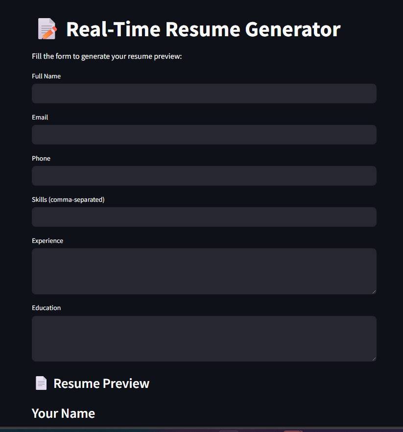

# 🧾 Real-Time Resume Generator





---

## 🚀 Overview

The **Real-Time Resume Generator** is a dynamic web application that allows users to generate modern, professional resumes based on live inputs. The app provides real-time preview and offers a downloadable PDF feature — all through a clean, user-friendly interface.

---

## 🔧 Features

- 📄 Live resume preview as you type  
- 🎨 Choose your own style via HTML/CSS templates  
- 📥 One-click PDF download  
- 📱 Fully responsive design  
- 🧠 Built using Streamlit with front-end enhancement

---

## 💻 Tech Stack

| Component      | Technologies Used              |
|----------------|-------------------------------|
| Frontend       | HTML, CSS, JavaScript, Bootstrap |
| Backend        | Streamlit, Python              |
| PDF Generator  | `xhtml2pdf` (PISA)             |

---

---

## ▶️ How to Run Locally

### 1. Clone the repository

```bash
git clone https://github.com/taqi-jpg/resume-generator.git
cd resume-generator/streamlit

 2. Install dependencies
bash
Copy
Edit
pip install -r ../_requirements.txt
3. Run the app
bash
Copy
Edit
streamlit run app.py
The app will be available at:
👉 http://localhost:8501

🌐 Live App
Try the hosted version on Streamlit Cloud:
🔗 https://taqi-jpg-resume-generator.streamlit.app

📁 Project Structure
lua
Copy
Edit
resume-generator/
├── index.html
├── style.css
├── script.js
├── streamlit/
│   ├── app.py
│   ├── _requirements.txt
│   └── assets/
│       └── preview.png
└── README.md
📜 License
This project is licensed under the MIT License.

🙌 Acknowledgements
Built with ❤️ by @taqi-jpg
